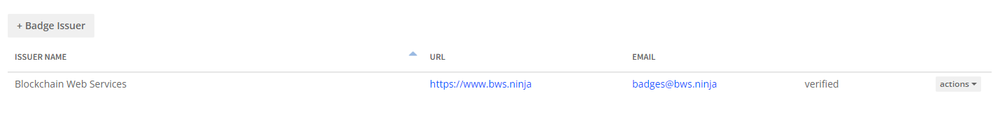
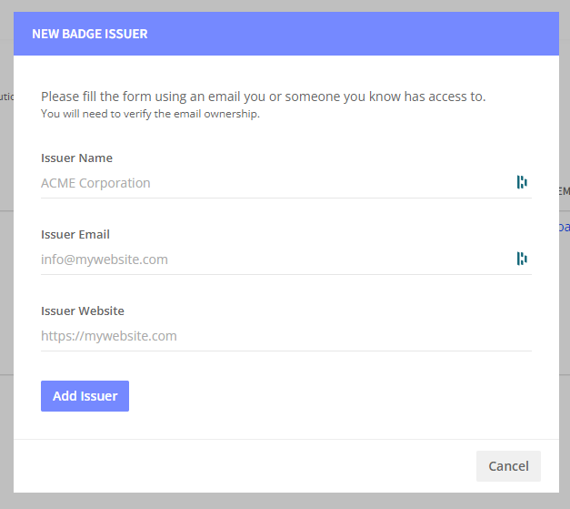
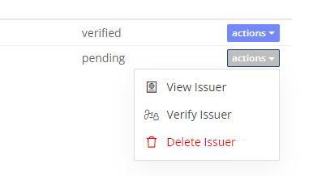
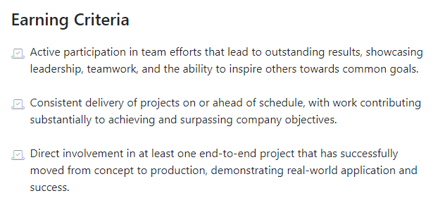
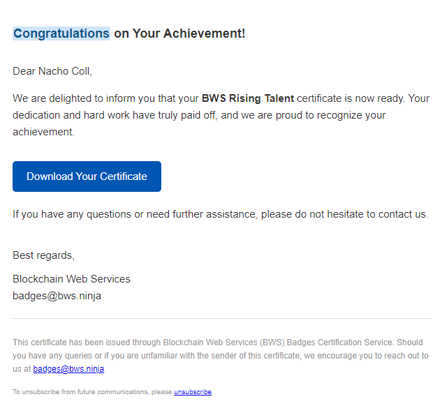

# Badges User Interface

Blockchain Badges provides a cutting-edge solution for issuing and managing verifiable digital credentials. Built on the open badge standard and enhanced with blockchain certification, our platform ensures secure, tamper-proof badges that can be trusted worldwide.

We offer a robust API for seamless integration into custom systems and a user-friendly interface for companies seeking a more straightforward, no-code solution. Whether through custom integration or an intuitive UI, Blockchain Badges makes credentialing straightforward and accessible for organizations of any size.

## [How to Start](badges-user-interface.md#how-to-start)

Visit www.bws.ninja, create an account (free), and select 'Blockchain Badges' from the top menu once you're in.&#x20;

<figure><figcaption></figcaption></figure>

### [Naming Conventions](badges-user-interface.md#naming-conventions)


**Open Badge V2.0**

We use the [Open Badge](https://openbadges.org/) standard, "**the world's leading format for digital badges".** Open Badges is not a specific product or platform but a type of digital badge that is verifiable, portable, and packed with information about skills and achievements.


Let's define the nomenclature you will find in our built-in interface and our [solution API](badges-api/).

**Issuer (Organization, Institution or Individual)**

An issuer is an entity that provides and awards digital badges to recipients.

When a badge is awarded, the issuer's information is encoded within the badge, allowing recipients to showcase their skills or achievements with verifiable proof of where the badge came from and what it represents.

**Badge (Digital Certificate, Credential)**

A badge is a digital representation of a skill, achievement, or learning outcome that an individual has acquired. It serves as verifiable, portable digital marks of recognition that can be shared across various platforms and environments.

**Award (Recognition, Accreditation, Endorsement)**

An award is a formal recognition of an individual's achievement, skill, or competency, represented by the issue of a digital badge. It validates the recipient's accomplishment and allows them to display and use the badge to symbolize their success and capability.

## [Manage Issuers](badges-user-interface.md#manage-issuers)

Using a simple Issuers list overview, you can Add and Delete badge issuers. Please note that once an Issuer has released an Award, you cannot delete it - badge data should be immutable for trust and transparency.

<figure><figcaption>
Issuers List
</figcaption></figure>

To **add a new issuer**, click on the "+ Badge Issuer" button, inform the Issuer Name, Issuer Email, and Issuer Website, and click the "Add Issuer" button.

<figure><figcaption>
Information required to define a new Issuer
</figcaption></figure>

Once registered, your new Issuer will get listed, and you can start creating new badges and reward Digital Certificates.


**Email Verification Required**

When adding a new issuer, the issuer's email will be subject to verification. We send a verification email containing a link and a code to the provided address.&#x20;

The email address owner must follow the instructions (if, for some reason, the email address owner doesn't want to use the verification link, you can ask him to provide the code he receives - you will also be able to verify the issuer using this code).



**How do you verify an issuer "manually"?**

If the issuer email owner prefers not to click on links provided in emails, ask him to send you the code included (for example, "CYMDF"). You can then verify the issuer by selecting "Verify Issuer" from the actions menu on the list.

<figure><figcaption>
Verify an Issuer using the code
</figcaption></figure>

## [Define new Badges](badges-user-interface.md#define-new-badges)

Once you've set up the Badge Issuers you manage, you can begin creating and customizing the badges you'll award to your alumni, team, or other recipients. Our intuitive badge designer tool makes this process simple and flexible. Start with a template, add images and text, and customize colors to reflect your branding or the recognized achievement. Designing a badge has never been easier!

<figure><figcaption></figcaption></figure>

As for the Open Badge specification, a badge consists of an image, a name, a description, and the criteria to be awarded.


**Criteria Text Formatting**

While there is no standard for the criteria format, and plain text should be used, we recommend that you write a line per each criterion required to get awarded. \
\
We will format each of the lines as in the example below.



## [Reward a Badge](badges-user-interface.md#reward-a-badge)

To create a new award, start by selecting the Issuer and the certificate you wish to award to an individual. Then, click the **"+ Award"** button. Enter the Certificate name, recipient’s email, and validity period. You can also choose from two optional features to enhance the award process:

1. **Send Award Email**: This option sends an email to the recipient with instructions on downloading and sharing their badge, ensuring a smooth and seamless experience.
2. **Blockchain Certification**: By enabling this option, the badge is certified on the blockchain, adding an extra layer of security and verifiability. Blockchain certification ensures the badge is tamper-proof and traceable, providing long-term credibility and trust for both the issuer and the recipient.


To use blockchain certification, you need a Professional Plan. The cost per award will be approximately 0.01 USD.


Once all details are set, click the **"Award Badge"** button to finalize the process.

<figure><figcaption></figcaption></figure>


**Important Note on Data Confidentiality.**

In full compliance with the General Data Protection Regulation (GDPR), our API is designed to be firmly committed to privacy and data protection. We understand the importance of safeguarding personal information and uphold the highest data privacy standards.

Our API processes email data in real-time. The data is transmitted securely and never recorded, stored, or saved on our servers.

If you check "send download instructions," you will receive an email with instructions on downloading, viewing, or sharing the recipient's new award.

If you decide not to send the instructions when creating a new certificate, you can still send them later. However, you must inform the recipient's email address to do so.


### Award Email

When a new award is created, you can email the recipient clear instructions on downloading and sharing their newly earned achievement. The email template below will notify the recipient if you send download instructions.

<figure><figcaption>
Download Instructions
</figcaption></figure>

## [Search Awards](badges-user-interface.md#search-awards)

You can use the recipient's name to search for awarded certificates. Go to the Award Badges menu option, select the badge you awarded the recipient, and use the search box to filter the results.&#x20;

<figure><figcaption></figcaption></figure>
