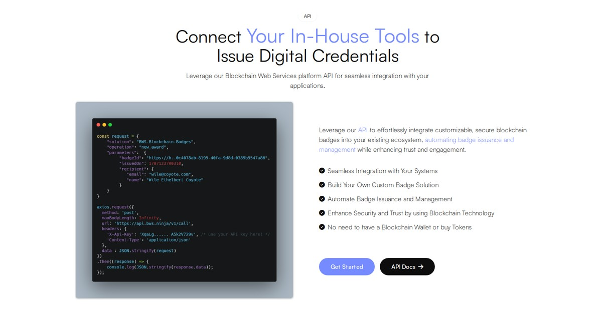
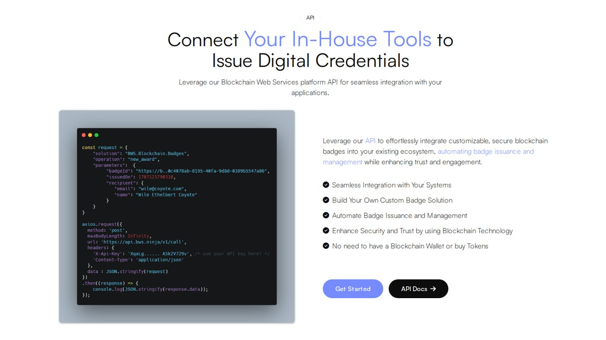
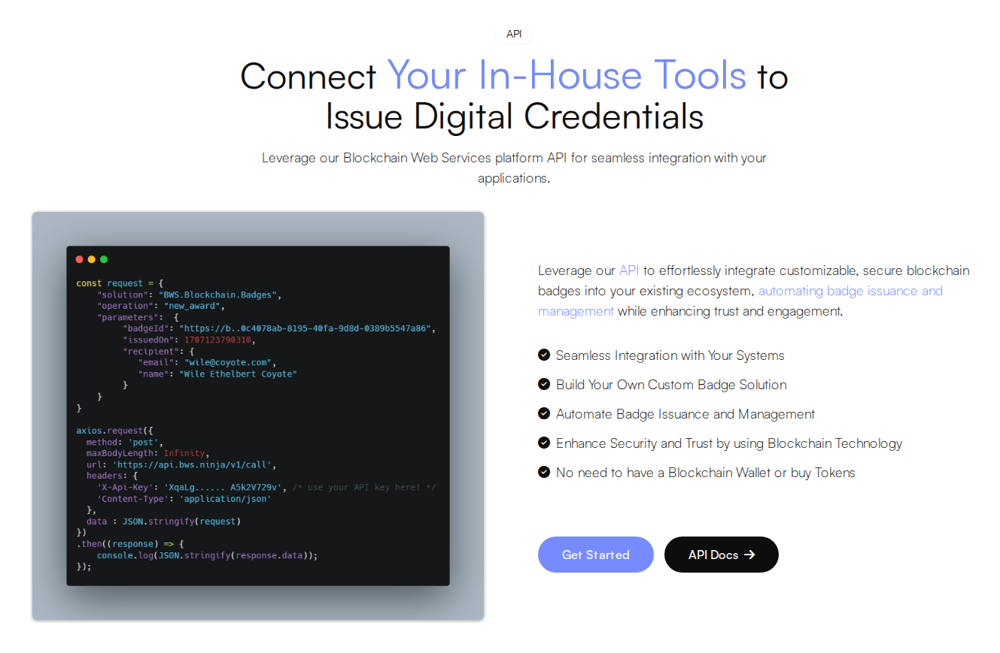
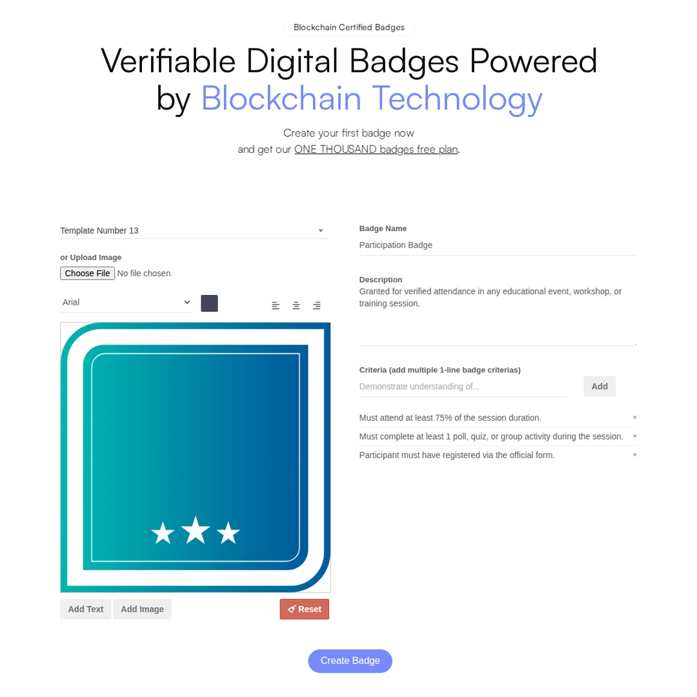
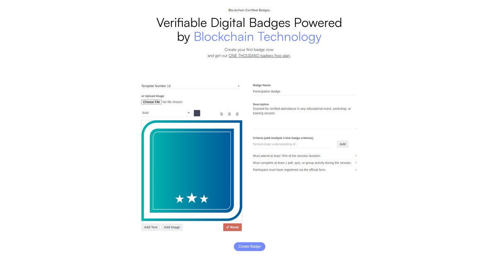
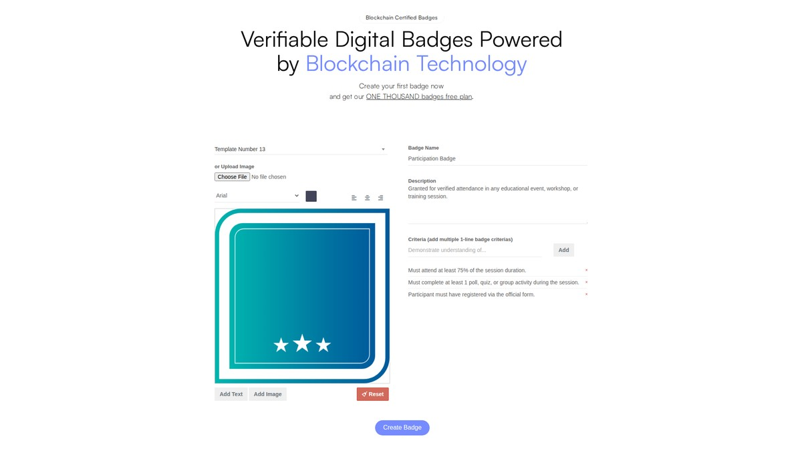
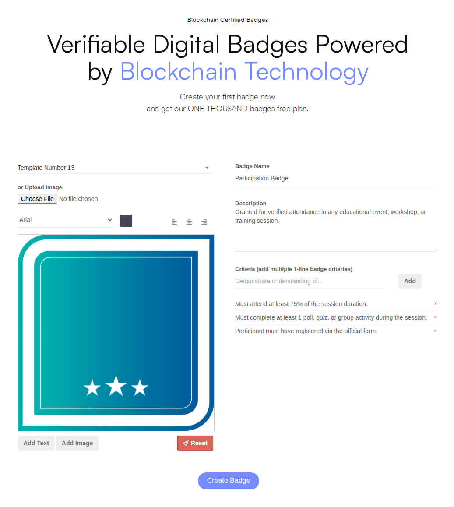

# Blockchain Badges - Media Assets

Product media library including website section captures, social media optimized images, and workflow demonstration videos.

<table><thead><tr><th width="180">Product</th><th width="140">Last Updated</th><th>Website</th></tr></thead><tbody><tr><td>Blockchain Badges</td><td>2026-04-12</td><td><a href="https://blockchainbadges.com">blockchainbadges.com</a></td></tr></tbody></table>


**About These Assets**

All assets on this page are automatically captured and updated weekly from the live Blockchain Badges website. Images are optimized for different platforms including social media (Twitter, LinkedIn, Instagram) and documentation.


---

## Api

API integration section - Connect Your In-House Tools

<figure><figcaption>
Linkedin (1080x1080px)
</figcaption></figure>

<figure><figcaption>
Twitter (1200x675px)
</figcaption></figure>

<figure><figcaption>
Desktop (Full Resolution)
</figcaption></figure>

## Hero

Hero section with badge creation preview

<figure><figcaption>
Instagram Post (1080x1080px)
</figcaption></figure>

<figure><figcaption>
Linkedin (1080x1080px)
</figcaption></figure>

<figure><figcaption>
Twitter (1200x675px)
</figcaption></figure>

<figure><figcaption>
Desktop (Full Resolution)
</figcaption></figure>

## Workflow Video

Create badge for ACME Corporation and process submission

<figure>
  <video src="videos/workflow-demo.webm" controls></video>
  <figcaption>
Create badge for ACME Corporation and process submission
</figcaption>
</figure>

---

## Download & Usage

### Social Media Formats

Ready-to-use images optimized for each platform:

* **Twitter/X:** 1200x675px (16:9 ratio) - Perfect for tweets and cards
* **LinkedIn:** 1200x627px (1.91:1 ratio) - Optimized for LinkedIn posts
* **Instagram:** 1080x1080px (1:1 square) - Instagram feed posts

### Documentation Use

Desktop resolution images are ideal for:
* Product documentation pages
* Knowledge base articles
* Help center content
* Internal wikis

---

## Related Documentation

<table data-view="cards"><thead><tr><th></th><th></th><th data-hidden data-card-target data-type="content-ref"></th></tr></thead><tbody><tr><td><strong>Product Documentation</strong></td><td>Full API and integration docs</td><td><a href="/marketplace-solutions/bws.blockchain.badges">/marketplace-solutions/bws.blockchain.badges</a></td></tr><tr><td><strong>All Product Snapshots</strong></td><td>Browse media for all products</td><td><a href="../">../</a></td></tr><tr><td><strong>Brand Guidelines</strong></td><td>BWS brand usage guidelines</td><td><a href="../../">../../</a></td></tr></tbody></table>
