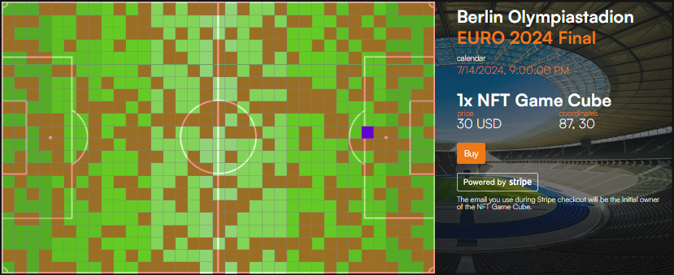
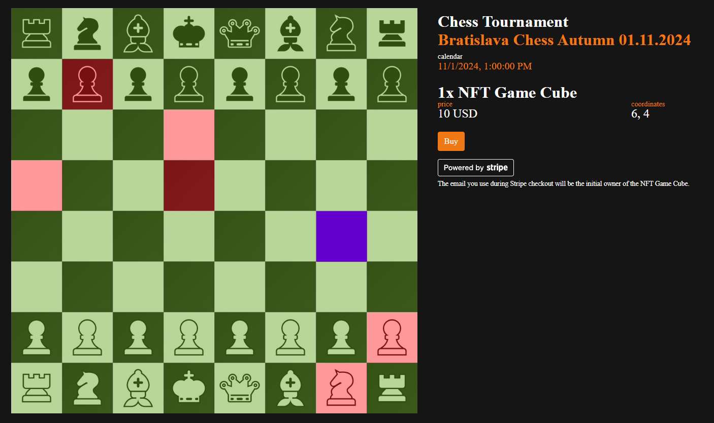

# NFT Game Cube - Complete Documentation

Product Key: BWS.NFT.GameCube
Generated: 2025-12-01T18:12:48.165Z
Files: 11
Words: 4,709
Characters: 50,337

---


## [FILE 1/11] README.md

Path: /mnt/x/Git/blockchain-web-services/bws/bws-front/docs.bws.ninja/marketplace-solutions/bws.nft.gamecube/README.md
---

---
description: Building New Revenue Streams for the Sports Industry
---

# BWS.NFT.GameCube

**NFT Game Cube is a scalable solution** where fans can play multiple sports and hold a weekend chess tournament, a soccer VIP final, and a cricket yearly season. It's a new sports fan experience.

A B2B2C platform solution **that provides a new revenue stream for any sports club worldwide**.

---


## [FILE 2/11] nft-game-cube-api/README.md

Path: /mnt/x/Git/blockchain-web-services/bws/bws-front/docs.bws.ninja/marketplace-solutions/bws.nft.gamecube/nft-game-cube-api/README.md
---

# NFT Game Cube API

---


## [FILE 3/11] nft-game-cube-api/calendar.md

Path: /mnt/x/Git/blockchain-web-services/bws/bws-front/docs.bws.ninja/marketplace-solutions/bws.nft.gamecube/nft-game-cube-api/calendar.md
---

# Calendar

Represents a **scheduled game, match, or tournament instance**—essentially, a **time-bound event** associated with a specific Field.

The `Calendar` object anchors the gameplay timeline, enabling season-based, game-based, or tournament-based fan campaigns. \
\
Examples:

* **UEFA Champions League Final**: Madrid vs PSG, for a single event calendar.
* **LaLiga 2025-2026**, including multiple matches, for the entire season calendar.

## new\_calendar

<mark style="color:green;">`POST`</mark> `https://api.bws.ninja/v1/call`

### Request Body

| Name                                         | Type   | Description             |
| -------------------------------------------- | ------ | ----------------------- |
| solution<mark style="color:red;">\*</mark>   | string | BWS.NFT.GameCube        |
| operation<mark style="color:red;">\*</mark>  | string | **new\_calendar**       |
| parameters<mark style="color:red;">\*</mark> | JSON   | check method parameters |

#### new\_field Method Parameters

<table><thead><tr><th width="155">Parameter</th><th width="102.33333333333331">Type</th><th>Desciption</th></tr></thead><tbody><tr><td>name</td><td>string</td><td>Calendar name (e.g. LaLiga 2025-26)</td></tr></tbody></table>

### new\_calendar API Call Example

[CODE EXAMPLES]

#### new\_calendar Call Response

When the API call is successfully executed, it returns the `calendarId`, which will be used to link with related objects.

```json
{
  "statusCode": 200,
  "info": {
      "calendarId": "8a7324f4-311d-43a8-a28f-87d9c424c354"
  }
}
```

## list\_calendars

<mark style="color:green;">`POST`</mark> `https://api.bws.ninja/v1/call`

### Request Body

| Name                                        | Type   | Description                                  |
| ------------------------------------------- | ------ | -------------------------------------------- |
| solution<mark style="color:red;">\*</mark>  | string | BWS.NFT.GameCube                             |
| operation<mark style="color:red;">\*</mark> | string | **list\_fields**                             |
| parameters                                  | JSON   | <p>(optional)<br>check method parameters</p> |

#### list\_calendars Method Parameters (optional)

<table><thead><tr><th width="135">Parameter</th><th width="102.33333333333331">Type</th><th>Desciption</th></tr></thead><tbody><tr><td>calendar_id</td><td>string</td><td>Calendar Id </td></tr></tbody></table>

### list\_calendars API Call Example

[CODE EXAMPLES]

#### list\_calendars Call Response

When the API call is successfully executed, it returns the list of calendars you created or a single calendar if the `CalendarId` parameter is included in the call.

```json
{
  "statusCode": 200,
  "info": {
    "calendars": [
            {
                "calendarId": "8a7324f4-311d-43a8-a28f-87d9c424c354",
                "data": {
                    "name": "2025-26"
                }
            }
        ]
  }
}
```

## delete\_calendar

<mark style="color:green;">`POST`</mark> `https://api.bws.ninja/v1/call`

### Request Body

| Name                                         | Type   | Description             |
| -------------------------------------------- | ------ | ----------------------- |
| solution<mark style="color:red;">\*</mark>   | string | BWS.NFT.GameCube        |
| operation<mark style="color:red;">\*</mark>  | string | **delete\_calendar**    |
| parameters<mark style="color:red;">\*</mark> | JSON   | check method parameters |

#### delete\_field Method Parameters

<table><thead><tr><th width="135">Parameter</th><th width="102.33333333333331">Type</th><th>Desciption</th></tr></thead><tbody><tr><td>calendarId</td><td>string</td><td>Then Calendar Id of the calendar to delete.</td></tr></tbody></table>

### delete\_calendar API Call Example

[CODE EXAMPLES]

#### delete\_calendar Call Response

When the API call is executed without errors, it returns a successful status code.

```json
{
  "statusCode": 200
}
```

---


## [FILE 4/11] nft-game-cube-api/cubes.md

Path: /mnt/x/Git/blockchain-web-services/bws/bws-front/docs.bws.ninja/marketplace-solutions/bws.nft.gamecube/nft-game-cube-api/cubes.md
---

# Cubes

Represents a **zone or tile within a Field**.

Each Cube is a unique NFT owned by a fan. It tracks ownership, enables rewards, and reflects live event impacts during matches.


## list\_cubes

<mark style="color:green;">`POST`</mark> `https://api.bws.ninja/v1/call`

### Request Body

| Name                                         | Type   | Description             |
| -------------------------------------------- | ------ | ----------------------- |
| solution<mark style="color:red;">\*</mark>   | string | BWS.NFT.GameCube        |
| operation<mark style="color:red;">\*</mark>  | string | **list\_cubes**         |
| parameters<mark style="color:red;">\*</mark> | JSON   | check method parameters |

#### new\_field Method Parameters

<table><thead><tr><th width="249">Parameter</th><th>Type</th><th>Desciption</th></tr></thead><tbody><tr><td>fieldId</td><td>string</td><td>Field Id.</td></tr><tr><td>limit</td><td>number</td><td>The maximum number of cubes returned (a field can have hundreds of cubes).</td></tr><tr><td>lastEvaluatedKey</td><td></td><td>(optional) If more cubes are available, include the returned key to get the next chink of cubes.</td></tr></tbody></table>

### list\_cubes API Call Example

[CODE EXAMPLES]

#### list\_cubes Call Response

When the API call is successfully executed, it returns a list of cubes and their related cube data, including the`cubeId`. If more cubes are available, the field lastEvaluatedKey is returned (include it on the API call for getting the next chunk of cubes).

```json
{
  "statusCode": 200,
  "info": {
        "cubes": [
            {
                "fieldId": "5a1486f3-753c-4194-b2d4-ea68b6e420c2",
                "cubeId": "ffcab6f9-1e3f-49df-9d53-28b1cbc1df57",
                "cubeIndex": "2700_1800",
                "status": "created",
                "data": {
                    "x": 2700,
                    "y": 1800,
                    "cubeLength": 300,
                    "i": 9,
                    "j": 6
                }
            },
            {
                "fieldId": "5a1486f3-753c-4194-b2d4-ea68b6e420c2",
                "cubeId": "ff86a9b3-ac68-456d-af12-2d4dc8622b94",
                "cubeIndex": "11400_1200",
                "status": "created",
                "data": {
                    "x": 11400,
                    "y": 1200,
                    "cubeLength": 300,
                    "i": 38,
                    "j": 4
                }
            },
            {
                "fieldId": "5a1486f3-753c-4194-b2d4-ea68b6e420c2",
                "cubeId": "ff742a73-5cff-4f86-b8cd-afa8fc864f95",
                "cubeIndex": "9000_7500",
                "status": "created",
                "data": {
                    "x": 9000,
                    "y": 7500,
                    "cubeLength": 300,
                    "i": 30,
                    "j": 25
                }
            },
            {
                "fieldId": "5a1486f3-753c-4194-b2d4-ea68b6e420c2",
                "cubeId": "ff2bec99-1e1c-479b-adb6-79775780eb56",
                "cubeIndex": "11400_3600",
                "status": "created",
                "data": {
                    "x": 11400,
                    "y": 3600,
                    "cubeLength": 300,
                    "i": 38,
                    "j": 12
                }
            },
            {
                "fieldId": "5a1486f3-753c-4194-b2d4-ea68b6e420c2",
                "cubeId": "ff248cbb-e7ab-4510-817f-53f7d56cf3e0",
                "cubeIndex": "8400_7200",
                "status": "created",
                "data": {
                    "x": 8400,
                    "y": 7200,
                    "cubeLength": 300,
                    "i": 28,
                    "j": 24
                }
            }
        ],
        "lastEvaluatedKey": "ff248cbb-e7ab-4510-817f-53f7d56cf3e0"
  }
}
```

## update\_cube-price

<mark style="color:green;">`POST`</mark> `https://api.bws.ninja/v1/call`

### Request Body

| Name                                        | Type   | Description             |
| ------------------------------------------- | ------ | ----------------------- |
| solution<mark style="color:red;">\*</mark>  | string | BWS.NFT.GameCube        |
| operation<mark style="color:red;">\*</mark> | string | **update\_cube-price**  |
| parameters                                  | JSON   | check method parameters |

#### update\_cube-price Method Parameters (optional)

<table><thead><tr><th width="143">Parameter</th><th width="102.33333333333331">Type</th><th>Desciption</th></tr></thead><tbody><tr><td>field_id</td><td>string</td><td>Field Id </td></tr><tr><td>cubesList</td><td>list</td><td>A list of cubes whose price needs to be updated. Use cube data <code>i</code> and <code>j</code> indexes to identify each cube using the format <code>i_j</code> (e.g. 40_0).</td></tr><tr><td>priceInCents</td><td>number</td><td>Price in USD cents (e.g. 500 to indicate a 5USD cube price)</td></tr></tbody></table>

### update\_cube-price API Call Example

[CODE EXAMPLES]

#### update\_cube-price Call Response

When the API call is successfully executed, it returns the number of correctly updated cubes, the number of invalid detected cubes, and the list of invalid cubes.

```json
{
  "statusCode": 200,
  "info": {
        "updatedCubes": 3,
        "invalidCubes": 1,
        "invalidCubesList": [
            "300_848483847938474000000"
        ]
  }
}
```

---


## [FILE 5/11] nft-game-cube-api/event-types.md

Path: /mnt/x/Git/blockchain-web-services/bws/bws-front/docs.bws.ninja/marketplace-solutions/bws.nft.gamecube/nft-game-cube-api/event-types.md
---

# Event Types

Defines **in-game occurrences** like goals, assists, or plays.

Events are registered with spatial coordinates and timestamps, affecting cube owners whose zones match the action location.

Examples:

* Pass
* Goal

## new\_event-type

<mark style="color:green;">`POST`</mark> `https://api.bws.ninja/v1/call`

### Request Body

| Name                                         | Type   | Description             |
| -------------------------------------------- | ------ | ----------------------- |
| solution<mark style="color:red;">\*</mark>   | string | BWS.NFT.GameCube        |
| operation<mark style="color:red;">\*</mark>  | string | **new\_event-type**     |
| parameters<mark style="color:red;">\*</mark> | JSON   | check method parameters |

#### new\_event-type Method Parameters

<table><thead><tr><th width="175">Parameter</th><th width="102.33333333333331">Type</th><th>Desciption</th></tr></thead><tbody><tr><td>fieldId</td><td>string</td><td>The Match Id we want to assign the prize.</td></tr><tr><td>eventTypeName</td><td>string </td><td>The event type name (e.g. "pass").</td></tr><tr><td>eventTypePoints</td><td>string</td><td>The number of points to assign when the event is detected on a specific cube (e.g. "100").</td></tr></tbody></table>

### new\_event-type API Call Example

[CODE EXAMPLES]

#### new\_event-type Call Response

When the API call is successfully executed, it returns the `evenTypeId`for the newly created event type (to be used when registering events).

```json
{
  "statusCode": 200,
  "info": {
       "eventTypeId": "34339c99-43cf-4fe9-b632-4f8606e3c1bc"
  }
}
```

## list\_event-types

<mark style="color:green;">`POST`</mark> `https://api.bws.ninja/v1/call`

### Request Body

| Name                                         | Type   | Description             |
| -------------------------------------------- | ------ | ----------------------- |
| solution<mark style="color:red;">\*</mark>   | string | BWS.NFT.GameCube        |
| operation<mark style="color:red;">\*</mark>  | string | **list\_match-prizes**  |
| parameters<mark style="color:red;">\*</mark> | JSON   | check method parameters |

#### list\_event-types Method Parameters (optional)

<table><thead><tr><th width="135">Parameter</th><th width="102.33333333333331">Type</th><th>Desciption</th></tr></thead><tbody><tr><td>fieldId</td><td>string</td><td>The Field Id to get the list of events.</td></tr></tbody></table>

### list\_match-prizes API Call Example

[CODE EXAMPLES]

#### list\_event-types Call Response

When the API call is successfully executed, it returns the field available events.

```json
{
  "statusCode": 200,
  "info": {
    "eventTypes": [
        {
            "fieldId": "5a1486f3-753c-4194-b2d4-ea68b6e420c2",
            "eventTypeId": "34339c99-43cf-4fe9-b632-4f8606e3c1bc",
            "eventTypeName": "pass",
            "eventTypePoints": "100"
        }
    ]
  }
}
```

## update\_event-type

<mark style="color:green;">`POST`</mark> `https://api.bws.ninja/v1/call`

### Request Body

| Name                                         | Type   | Description             |
| -------------------------------------------- | ------ | ----------------------- |
| solution<mark style="color:red;">\*</mark>   | string | BWS.NFT.GameCube        |
| operation<mark style="color:red;">\*</mark>  | string | **update\_event-type**  |
| parameters<mark style="color:red;">\*</mark> | JSON   | check method parameters |

#### update\_event-type Method Parameters

<table><thead><tr><th width="169">Parameter</th><th width="102.33333333333331">Type</th><th>Desciption</th></tr></thead><tbody><tr><td>eventTypeId</td><td>string</td><td>The Event Type Id we want to update the assigned points.</td></tr><tr><td>fieldId</td><td>string</td><td>The Field Id the event is linked to.</td></tr><tr><td>eventTypePoints</td><td>string</td><td>The new number points assigned to the event (e.g. "1000")</td></tr></tbody></table>

### update\_event-type API Call Example

[CODE EXAMPLES]

#### update\_match-prize Call Response

When the API call is executed without errors, it returns a successful status code.

```json
{
  "statusCode": 200
}
```

## delete\_event-type

<mark style="color:green;">`POST`</mark> `https://api.bws.ninja/v1/call`

### Request Body

| Name                                         | Type   | Description             |
| -------------------------------------------- | ------ | ----------------------- |
| solution<mark style="color:red;">\*</mark>   | string | BWS.NFT.GameCube        |
| operation<mark style="color:red;">\*</mark>  | string | **delete\_event-type**  |
| parameters<mark style="color:red;">\*</mark> | JSON   | check method parameters |

#### delete\_event-type Method Parameters

<table><thead><tr><th width="162">Parameter</th><th width="102.33333333333331">Type</th><th>Desciption</th></tr></thead><tbody><tr><td>eventTypeId</td><td>string</td><td>The Event Type Id if the event we want to delete.</td></tr><tr><td>fieldId</td><td>string</td><td>The Field Id the event is linked to.</td></tr></tbody></table>

### delete\_event-type API Call Example

[CODE EXAMPLES]

#### delete\_event-type Call Response

When the API call is executed without errors, it returns a successful status code.

```json
{
  "statusCode": 200
}
```

---


## [FILE 6/11] nft-game-cube-api/field.md

Path: /mnt/x/Git/blockchain-web-services/bws/bws-front/docs.bws.ninja/marketplace-solutions/bws.nft.gamecube/nft-game-cube-api/field.md
---

# Field

Represents a **virtual sports field** tokenized into interactive zones or sections ("CUBES"). It is the foundational canvas for all game interactions.&#x20;

Each field is typically linked to a real-world sports match.\
\
Examples:

* Real Madrid Stadium
* Madison Square Garden

## new\_field

<mark style="color:green;">`POST`</mark> `https://api.bws.ninja/v1/call`

### Request Body

| Name                                         | Type   | Description             |
| -------------------------------------------- | ------ | ----------------------- |
| solution<mark style="color:red;">\*</mark>   | string | BWS.NFT.GameCube        |
| operation<mark style="color:red;">\*</mark>  | string | **new\_field**          |
| parameters<mark style="color:red;">\*</mark> | JSON   | check method parameters |

#### new\_field Method Parameters

<table><thead><tr><th width="135">Parameter</th><th width="102.33333333333331">Type</th><th>Desciption</th></tr></thead><tbody><tr><td>name</td><td>string</td><td>Field name (e.g. Camp Nou)</td></tr><tr><td>sport</td><td>string</td><td>Sport (e.g. Football)</td></tr><tr><td>fieldLength</td><td>number</td><td>Field length in centimeters (e.g. 12000)</td></tr><tr><td>fieldWidth</td><td>number</td><td>Field width in centimeters (e.g. 9000)</td></tr><tr><td>cubeLength</td><td>number</td><td>The square size of a single cube (e.g. 300 for a cube of 3x3 meters)</td></tr></tbody></table>

### new\_field API Call Example

[CODE EXAMPLES]

#### new\_field Call Response

When the API call is successfully executed, it returns the`fieldId`, which will be used to link NFT Game Cube related objects.

All the cubes for that field are created when creating a new field.

```json
{
  "statusCode": 200,
  "info": {
    "fieldId": "5a1486f3-753c-4194-b2d4-ea68b6e420c2"
  }
}
```

## list\_fields

<mark style="color:green;">`POST`</mark> `https://api.bws.ninja/v1/call`

### Request Body

| Name                                        | Type   | Description                                  |
| ------------------------------------------- | ------ | -------------------------------------------- |
| solution<mark style="color:red;">\*</mark>  | string | BWS.NFT.GameCube                             |
| operation<mark style="color:red;">\*</mark> | string | **list\_fields**                             |
| parameters                                  | JSON   | <p>(optional)<br>check method parameters</p> |

#### list\_fields Method Parameters (optional)

<table><thead><tr><th width="135">Parameter</th><th width="102.33333333333331">Type</th><th>Desciption</th></tr></thead><tbody><tr><td>field_id</td><td>string</td><td>Field Id </td></tr></tbody></table>

### list\_fields API Call Example

[CODE EXAMPLES]

#### list\_fields Call Response

When the API call is successfully executed, it returns the list of fields you created or a single field if `fieldId`parameter is included in the call.

```json
{
  "statusCode": 200,
  "info": {
     "fields": [
            {
                "fieldId": "5a1486f3-753c-4194-b2d4-ea68b6e420c2",
                "status": "ready",
                "data": {
                    "name": "Camp Nou",
                    "sport": "football",
                    "fieldLength": 12000,
                    "fieldWidth": 8000,
                    "cubeLength": 300
                }
            }
        ]
  }
}
```

## delete\_field

<mark style="color:green;">`POST`</mark> `https://api.bws.ninja/v1/call`

### Request Body

| Name                                         | Type   | Description             |
| -------------------------------------------- | ------ | ----------------------- |
| solution<mark style="color:red;">\*</mark>   | string | BWS.NFT.GameCube        |
| operation<mark style="color:red;">\*</mark>  | string | **delete\_field**       |
| parameters<mark style="color:red;">\*</mark> | JSON   | check method parameters |

#### delete\_field Method Parameters

<table><thead><tr><th width="135">Parameter</th><th width="102.33333333333331">Type</th><th>Desciption</th></tr></thead><tbody><tr><td>fieldId</td><td>string</td><td>Field Id to delete.</td></tr></tbody></table>

### delete\_field API Call Example

[CODE EXAMPLES]

#### delete\_field Call Response

When the API call is executed without errors, it returns a successful status code.


```json
{
  "statusCode": 200,
  "info": {
    "fieldId": "5a1486f3-753c-4194-b2d4-ea68b6e420c2"
  }
}
```

---


## [FILE 7/11] nft-game-cube-api/live-events.md

Path: /mnt/x/Git/blockchain-web-services/bws/bws-front/docs.bws.ninja/marketplace-solutions/bws.nft.gamecube/nft-game-cube-api/live-events.md
---

# Live Events

`LiveEvent` is the **base API object** used to **record an in-match event** that occurs at a specific coordinate (`x`, `y`) on a Field during a scheduled Match (`Calendar`). It is the **primary mechanism** by which game data—such as goals, moves, fouls, or plays—is captured and mapped to corresponding Cubes for scoring and reward processing.

This API serves as a trusted interface to power fan engagement:

* **Manually** via the **organizer dashboard or solution UI (BWS Solution Interface)**
* **Automatically** via **BWS-provided machine learning models** that detect and push game events in real time (e.g., AI-driven goal recognition, chess move capture)
* Through your application.

## new\_event

<mark style="color:green;">`POST`</mark> `https://api.bws.ninja/v1/call`

### Request Body

| Name                                         | Type   | Description             |
| -------------------------------------------- | ------ | ----------------------- |
| solution<mark style="color:red;">\*</mark>   | string | BWS.NFT.GameCube        |
| operation<mark style="color:red;">\*</mark>  | string | **new\_event**          |
| parameters<mark style="color:red;">\*</mark> | JSON   | check method parameters |

#### new\_event Method Parameters

<table><thead><tr><th width="152">Parameter</th><th width="99.33333333333331">Type</th><th>Desciption</th></tr></thead><tbody><tr><td>matchId</td><td>string</td><td>The Match Id for which you want to register the event.</td></tr><tr><td>fieldId</td><td>string</td><td>The Field Id the match is linked to.</td></tr><tr><td>calendarId</td><td>string </td><td>The calendar Id the match is linked to.</td></tr><tr><td>event</td><td>JSON</td><td>check event parameter</td></tr></tbody></table>

#### new\_event Event Parameter

<table><thead><tr><th width="152">Parameter</th><th width="99.33333333333331">Type</th><th>Desciption</th></tr></thead><tbody><tr><td>coordinates</td><td>JSON</td><td>check coordinates parameter</td></tr><tr><td>eventTypeId</td><td>string</td><td>The Event Type Id of the event you want to register.</td></tr></tbody></table>

#### new\_event Coordinates Parameter

<table><thead><tr><th width="152">Parameter</th><th width="99.33333333333331">Type</th><th>Desciption</th></tr></thead><tbody><tr><td>x</td><td>string</td><td>The 2D x coordinate of the event. </td></tr><tr><td>y</td><td>string</td><td>The 2D y coordinate of the event.</td></tr></tbody></table>

### new\_event API Call Example

[CODE EXAMPLES]

#### new\_event Call Response

When the API call is executed without errors, it returns a successful status code.

```json
{
  "statusCode": 200
}
```

---


## [FILE 8/11] nft-game-cube-api/match.md

Path: /mnt/x/Git/blockchain-web-services/bws/bws-front/docs.bws.ninja/marketplace-solutions/bws.nft.gamecube/nft-game-cube-api/match.md
---

# Match

A **Match** is a **time-bound, gameplay session** tied to a specific Field, during which events are tracked, points are awarded, and fan interactions occur. It represents a game instance—such as a football match, chess round, or tournament heat—scheduled via the `Calendar` object and hosted on a defined `Field`.\


Examples:

* PSG vs. Manchester City
* Green Bay Packers vs Chicago Bears
* Magnus Carlsen vs Hikaru Nakamura


## new\_match

<mark style="color:green;">`POST`</mark> `https://api.bws.ninja/v1/call`

### Request Body

| Name                                         | Type   | Description             |
| -------------------------------------------- | ------ | ----------------------- |
| solution<mark style="color:red;">\*</mark>   | string | BWS.NFT.GameCube        |
| operation<mark style="color:red;">\*</mark>  | string | **new\_match**          |
| parameters<mark style="color:red;">\*</mark> | JSON   | check method parameters |

#### new\_match Method Parameters


<table><thead><tr><th width="182">Parameter</th><th width="102.33333333333331">Type</th><th>Desciption</th></tr></thead><tbody><tr><td>calendarId<mark style="color:red;">*</mark></td><td>string </td><td>Calendar Id the match should be included in.</td></tr><tr><td>startTimeInMillis<mark style="color:red;">*</mark></td><td>number</td><td>The expected match start time in milliseconds.</td></tr><tr><td>name</td><td>string</td><td>The match short name.</td></tr><tr><td>description</td><td>string</td><td>Match description.</td></tr><tr><td>image</td><td>string</td><td>An image base64 encoded string to announce the match.</td></tr><tr><td>team1Name</td><td>string</td><td>The team name (e.g. Manchester City)</td></tr><tr><td>team1Flag</td><td>string</td><td>An image base64 ecoded string representing the team flag.</td></tr><tr><td>team2Name</td><td>string </td><td>The team name (e.g. LA Lakers)</td></tr><tr><td>team2Flag</td><td>string</td><td>An image base64 ecoded string representing the team flag.</td></tr><tr><td>status</td><td>string</td><td>The match status. Use one of the following values: "scheduled", "playing", "finished", "canceled".</td></tr><tr><td>priceInCents</td><td>number</td><td>The default price in USD cents for all the cubes if no specific price is defined for a cube (e.g. 1000 for 10 USD).</td></tr></tbody></table>

### new\_match API Call Example

[CODE EXAMPLES]

#### new\_match Call Response

When the API call is successfully executed, it returns the`matchId` for the newly created match.

```json
{
  "statusCode": 200,
  "info": {
        "matchId": "e16d3f98-4eeb-44b9-837c-eddbbfe305ee"
  }
}
```

## update\_match

<mark style="color:green;">`POST`</mark> `https://api.bws.ninja/v1/call`

### Request Body

| Name                                         | Type   | Description             |
| -------------------------------------------- | ------ | ----------------------- |
| solution<mark style="color:red;">\*</mark>   | string | BWS.NFT.GameCube        |
| operation<mark style="color:red;">\*</mark>  | string | **update\_match**       |
| parameters<mark style="color:red;">\*</mark> | JSON   | check method parameters |

#### update\_match Method Parameters


<table><thead><tr><th width="182">Parameter</th><th width="114.33333333333331">Type</th><th>Desciption</th></tr></thead><tbody><tr><td>calendarId<mark style="color:red;">*</mark></td><td>string </td><td>Calendar Id the match is included in.</td></tr><tr><td>matchId<mark style="color:red;">*</mark></td><td>string</td><td>The Match Id we want to update.</td></tr><tr><td>startTimeInMillis</td><td>number</td><td>The expected match start time in milliseconds.</td></tr><tr><td>name</td><td>string</td><td>The match short name.</td></tr><tr><td>description</td><td>string</td><td>Match description.</td></tr><tr><td>image</td><td>string</td><td>An image base64 encoded string to announce the match.</td></tr><tr><td>team1Name</td><td>string</td><td>The team name (e.g. Manchester City)</td></tr><tr><td>team1Flag</td><td>string</td><td>An image base64 ecoded string representing the team flag.</td></tr><tr><td>team2Name</td><td>string </td><td>The team name (e.g. LA Lakers)</td></tr><tr><td>team2Flag</td><td>string</td><td>An image base64 ecoded string representing the team flag.</td></tr><tr><td>status</td><td>string</td><td>The match status. Use one of the following values: "scheduled", "playing", "finished", "canceled"</td></tr><tr><td>priceInCents</td><td>number</td><td>The price in USD cents (e.g. 1000 for 10 USD)</td></tr></tbody></table>

### update\_match API Call Example

[CODE EXAMPLES]

#### update\_match Call Response

When the API call is successfully executed, it returns the`matchId` for the updated match.

```json
{
  "statusCode": 200,
  "info": {
        "matchId": "e16d3f98-4eeb-44b9-837c-eddbbfe305ee"
  }
}
```

## list\_matches

<mark style="color:green;">`POST`</mark> `https://api.bws.ninja/v1/call`

### Request Body

| Name                                        | Type   | Description             |
| ------------------------------------------- | ------ | ----------------------- |
| solution<mark style="color:red;">\*</mark>  | string | BWS.NFT.GameCube        |
| operation<mark style="color:red;">\*</mark> | string | **list\_matches**       |
| parameters                                  | JSON   | check method parameters |

#### list\_matches Method Parameters (optional)

<table><thead><tr><th width="135">Parameter</th><th width="102.33333333333331">Type</th><th>Desciption</th></tr></thead><tbody><tr><td>calendar_id</td><td>string</td><td>The Calendar Id the match is linked to.</td></tr><tr><td>matchId</td><td>string</td><td>(optional) The Match Id we want to list.</td></tr></tbody></table>

### list\_matches API Call Example

[CODE EXAMPLES]

#### list\_matches Call Response

When the API call is successfully executed, it returns the matches for the provided calendar. If we give a Match Id, it will just return the match we want to list.

```json
{
  "statusCode": 200,
  "info": {
    "matches": [
        {
            "calendarId": "8a7324f4-311d-43a8-a28f-87d9c424c354",
            "matchId": "e16d3f98-4eeb-44b9-837c-eddbbfe305ee",
            "startTimeInMillis": "1737795600000",
            "status": "scheduled",
            "data": {
                "name": "PSG vs Man City",
                "description": "Paris Saint-Germain will face Manchester City ...",
                "image": "https://ipfs.bws.ninja/ipfs/QmQnRDsQPvNJ9RgT9bagHmCLQVxCyZxatkPpj3Avb1hsM8"
            }
        }
    ]
  }
}
```

## delete\_match

<mark style="color:green;">`POST`</mark> `https://api.bws.ninja/v1/call`

### Request Body

| Name                                         | Type   | Description             |
| -------------------------------------------- | ------ | ----------------------- |
| solution<mark style="color:red;">\*</mark>   | string | BWS.NFT.GameCube        |
| operation<mark style="color:red;">\*</mark>  | string | **delete\_calendar**    |
| parameters<mark style="color:red;">\*</mark> | JSON   | check method parameters |

#### delete\_match Method Parameters

<table><thead><tr><th width="135">Parameter</th><th width="102.33333333333331">Type</th><th>Desciption</th></tr></thead><tbody><tr><td>matchId</td><td>string</td><td>The Match Id of the match we want to delete.</td></tr><tr><td>calendarId</td><td>string</td><td>The Calendar Id the match is linked to.</td></tr></tbody></table>

### delete\_match API Call Example

[CODE EXAMPLES]

#### delete\_match Call Response

When the API call is executed without errors, it returns a successful status code.

```json
{
  "statusCode": 200
}
```

---


## [FILE 9/11] nft-game-cube-api/plays-field-calendar.md

Path: /mnt/x/Git/blockchain-web-services/bws/bws-front/docs.bws.ninja/marketplace-solutions/bws.nft.gamecube/nft-game-cube-api/plays-field-calendar.md
---

# Plays (Field-Calendar)

This relationship models the **temporal lifecycle of a Field** in the NFT Game Cube solution. A `Field` defines a sports ground's static, spatial configuration (like a 12×8 football pitch), while `Calendar` entries dynamically represent individual **matches**, **tournaments**, or **rounds** on that Field.

Examples:

* PSG Champions League 2026&#x20;
* New York Knicks 2026 NBA Season


## new\_field-calendar

<mark style="color:green;">`POST`</mark> `https://api.bws.ninja/v1/call`

### Request Body

| Name                                         | Type   | Description             |
| -------------------------------------------- | ------ | ----------------------- |
| solution<mark style="color:red;">\*</mark>   | string | BWS.NFT.GameCube        |
| operation<mark style="color:red;">\*</mark>  | string | **new\_calendar**       |
| parameters<mark style="color:red;">\*</mark> | JSON   | check method parameters |

#### new\_field-calendar Method Parameters

<table><thead><tr><th width="155">Parameter</th><th width="102.33333333333331">Type</th><th>Desciption</th></tr></thead><tbody><tr><td>fieldId</td><td>string</td><td>Field Id.</td></tr><tr><td>calendarId</td><td>string </td><td>Calendar Id.</td></tr><tr><td>description</td><td>string </td><td>The field calendar name (e.g. PSG 2025-26)</td></tr><tr><td>image</td><td>string</td><td>An image base64 encoded.</td></tr></tbody></table>

### new\_field-calendar API Call Example

[CODE EXAMPLES]

#### new\_field-calendar Call Response

When the API call is successfully executed, it returns the `fieldId` and `calendarId` used to create the calendar and the related data, including the name and the image IPFS url.

```json
{
  "statusCode": 200,
  "info": {
        "fieldId": "5a1486f3-753c-4194-b2d4-ea68b6e420c2",
        "calendarId": "8a7324f4-311d-43a8-a28f-87d9c424c354",
        "data": {
            "name": "PSG 2025-26",
            "image": "https://ipfs.bws.ninja/ipfs/QmQnRDsQPvNJ9RgT9bagHmCLQVxCyZxatkPpj3Avb1hsM8"
        }
  }
}
```

## list\_field-calendars

<mark style="color:green;">`POST`</mark> `https://api.bws.ninja/v1/call`

### Request Body

| Name                                        | Type   | Description               |
| ------------------------------------------- | ------ | ------------------------- |
| solution<mark style="color:red;">\*</mark>  | string | BWS.NFT.GameCube          |
| operation<mark style="color:red;">\*</mark> | string | **list\_field-calendars** |
| parameters                                  | JSON   | check method parameters   |

#### list\_field-calendars Method Parameters (optional)

<table><thead><tr><th width="135">Parameter</th><th width="102.33333333333331">Type</th><th>Desciption</th></tr></thead><tbody><tr><td>field_id</td><td>string</td><td>Field Id </td></tr></tbody></table>

### list\_field-calendars API Call Example

[CODE EXAMPLES]

#### list\_field-calendars Call Response

When the API call is successfully executed, it returns the calendars list linked to the provided field.

```json
{
  "statusCode": 200,
  "info": {
    "calendars": [
            {
                "fieldId": "5a1486f3-753c-4194-b2d4-ea68b6e420c2",
                "calendarId": "8a7324f4-311d-43a8-a28f-87d9c424c354",
                "data": {
                    "name": "PSG 2025-26",
                    "image": "https://ipfs.bws.ninja/ipfs/QmQnRDsQPvNJ9RgT9bagHmCLQVxCyZxatkPpj3Avb1hsM8"
                }
            }
        ]
  }
}
```

## delete\_field-calendar

<mark style="color:green;">`POST`</mark> `https://api.bws.ninja/v1/call`

### Request Body

| Name                                         | Type   | Description             |
| -------------------------------------------- | ------ | ----------------------- |
| solution<mark style="color:red;">\*</mark>   | string | BWS.NFT.GameCube        |
| operation<mark style="color:red;">\*</mark>  | string | **delete\_calendar**    |
| parameters<mark style="color:red;">\*</mark> | JSON   | check method parameters |

#### delete\_field-calendar Method Parameters

<table><thead><tr><th width="135">Parameter</th><th width="102.33333333333331">Type</th><th>Desciption</th></tr></thead><tbody><tr><td>fieldId</td><td>string </td><td>The Filed Id we used to create the relationship we want to delete.</td></tr><tr><td>calendarId</td><td>string</td><td>The Calendar Id we used to create the relatinship to delete.</td></tr></tbody></table>

### delete\_field-calendar API Call Example

[CODE EXAMPLES]

#### delete\_field-calendar Call Response

When the API call is executed without errors, it returns a successful status code.

```json
{
  "statusCode": 200
}
```

---


## [FILE 10/11] nft-game-cube-api/prizes.md

Path: /mnt/x/Git/blockchain-web-services/bws/bws-front/docs.bws.ninja/marketplace-solutions/bws.nft.gamecube/nft-game-cube-api/prizes.md
---

# Prizes

A **Prize** represents a **reward asset or benefit** that users can receive based on their CUBE performance, in a specific **Match (or Season)**. It can be a digital NFT, a token bonus, a physical good, or an experience, configurable by the solution owner to drive fan engagement and incentivize Cube ownership.\
\
Examples:

* Signed Merchandise
* VIP Match Tickets
* Zoom Call or AMA with an Athlete
* Bonus $BWS Tokens


## new\_match-prize

<mark style="color:green;">`POST`</mark> `https://api.bws.ninja/v1/call`

### Request Body

| Name                                         | Type   | Description             |
| -------------------------------------------- | ------ | ----------------------- |
| solution<mark style="color:red;">\*</mark>   | string | BWS.NFT.GameCube        |
| operation<mark style="color:red;">\*</mark>  | string | **new\_match-prize**    |
| parameters<mark style="color:red;">\*</mark> | JSON   | check method parameters |

#### new\_match-prize Method Parameters

<table><thead><tr><th width="145">Parameter</th><th width="102.33333333333331">Type</th><th>Desciption</th></tr></thead><tbody><tr><td>matchId<mark style="color:red;">*</mark></td><td>string</td><td>The Match Id we want to assign the prize.</td></tr><tr><td>calendarId<mark style="color:red;">*</mark></td><td>string </td><td>Calendar Id of the match.</td></tr><tr><td>position<mark style="color:red;">*</mark></td><td>number</td><td>1, 2 or 3 for first, second and third prize.</td></tr><tr><td>name<mark style="color:red;">*</mark></td><td>string</td><td>The prize name (e.g. FODEN SIGNED FRAME)</td></tr><tr><td>description<mark style="color:red;">*</mark></td><td>string</td><td>Prize description (e.g. Phil Foden, known for his incredible..)</td></tr><tr><td>snapshot<mark style="color:red;">*</mark></td><td>string</td><td>An image base64 encoded string to announce the match.</td></tr><tr><td>htmlDescription</td><td>string</td><td>The HTML description of the prize (e.g. &#x3C;div>&#x3C;p>The ...)</td></tr><tr><td>image1</td><td>string</td><td>An image base64 encoded string.</td></tr><tr><td>image2</td><td>string</td><td>An image base64 encoded string.</td></tr><tr><td>image3</td><td>string</td><td>An image base64 encoded string.</td></tr></tbody></table>

### new\_match-prize API Call Example

[CODE EXAMPLES]

#### new\_match-prize Call Response

When the API call is successfully executed, it returns the `prizeId` for the newly created prize.

```json
{
  "statusCode": 200,
  "info": {
       "prizeId": "b6ec4971-b573-4bfc-981c-582a33006abf"
  }
}
```

## list\_match-prizes

<mark style="color:green;">`POST`</mark> `https://api.bws.ninja/v1/call`

### Request Body

| Name                                         | Type   | Description             |
| -------------------------------------------- | ------ | ----------------------- |
| solution<mark style="color:red;">\*</mark>   | string | BWS.NFT.GameCube        |
| operation<mark style="color:red;">\*</mark>  | string | **list\_match-prizes**  |
| parameters<mark style="color:red;">\*</mark> | JSON   | check method parameters |

#### list\_match-prizes Method Parameters (optional)

<table><thead><tr><th width="135">Parameter</th><th width="102.33333333333331">Type</th><th>Desciption</th></tr></thead><tbody><tr><td>matchId</td><td>string</td><td>The Match Id we want to list the prizes.</td></tr></tbody></table>

### list\_match-prizes API Call Example

[CODE EXAMPLES]

#### list\_match-prizes Call Response

When the API call is successfully executed, it returns the match prizes, including the image IPFS url.

```json
{
  "statusCode": 200,
  "info": {
   "prizes": [
        {
            "prizeId": "b6ec4971-b573-4bfc-981c-582a33006abf",
            "matchId": "e16d3f98-4eeb-44b9-837c-eddbbfe305ee",
            "position": "3",
            "calendarId": "8a7324f4-311d-43a8-a28f-87d9c424c354",
            "data": {
                "name": "FODEN SIGNED FRAME",
                "description": "Phil Foden, known for his incredible skill, vision, and versatility, has dazzled fans and critics alike with his breathtaking performances.",
                "snapshot": "https://ipfs.bws.ninja/ipfs/QmSg27Xz3yWva6yM9Agn7JWYVyKH35uVdaUHe58Jhnks9a"
            }
        }
    ]
  }
}
```

## update\_match-prize

<mark style="color:green;">`POST`</mark> `https://api.bws.ninja/v1/call`

### Request Body

| Name                                         | Type   | Description             |
| -------------------------------------------- | ------ | ----------------------- |
| solution<mark style="color:red;">\*</mark>   | string | BWS.NFT.GameCube        |
| operation<mark style="color:red;">\*</mark>  | string | **update-match-prize**  |
| parameters<mark style="color:red;">\*</mark> | JSON   | check method parameters |

#### update\_match-prize Method Parameters

<table data-full-width="true"><thead><tr><th width="145">Parameter</th><th width="90.33333333333331">Type</th><th>Desciption</th></tr></thead><tbody><tr><td>matchId<mark style="color:red;">*</mark></td><td>string</td><td>The Match Id we want to assign the prize.</td></tr><tr><td>calendarId<mark style="color:red;">*</mark></td><td>string </td><td>Calendar Id of the match.</td></tr><tr><td>prizeId<mark style="color:red;">*</mark></td><td>string</td><td>The prize Id you get when creating a new match prize.</td></tr><tr><td>name</td><td>string</td><td>The prize name (e.g. FODEN SIGNED FRAME)</td></tr><tr><td>description</td><td>string</td><td>Prize description (e.g. Phil Foden, known for his incredible..)</td></tr><tr><td>snapshot</td><td>string</td><td>An image base64 encoded string to announce the match.</td></tr><tr><td>htmlDescription</td><td>string</td><td>The HTML description of the prize (e.g. &#x3C;div>&#x3C;p>The ...)</td></tr><tr><td>image1</td><td>string</td><td>An image base64 encoded string.</td></tr><tr><td>image2</td><td>string</td><td>An image base64 encoded string.</td></tr><tr><td>image3</td><td>string</td><td>An image base64 encoded string.</td></tr></tbody></table>

### update\_match-prize API Call Example

[CODE EXAMPLES]

#### update\_match-prize Call Response

When the API call is executed without errors, it returns a successful status code.

```json
{
  "statusCode": 200
}
```

## delete\_match-prize

<mark style="color:green;">`POST`</mark> `https://api.bws.ninja/v1/call`

### Request Body

| Name                                         | Type   | Description             |
| -------------------------------------------- | ------ | ----------------------- |
| solution<mark style="color:red;">\*</mark>   | string | BWS.NFT.GameCube        |
| operation<mark style="color:red;">\*</mark>  | string | **delete\_match-prize** |
| parameters<mark style="color:red;">\*</mark> | JSON   | check method parameters |

#### delete\_match-prize Method Parameters

<table><thead><tr><th width="135">Parameter</th><th width="102.33333333333331">Type</th><th>Desciption</th></tr></thead><tbody><tr><td>prizeId</td><td>string</td><td>The Prize Id to delete.</td></tr></tbody></table>

### delete\_match-prize API Call Example

[CODE EXAMPLES]

#### delete\_match-prize Call Response

When the API call is executed without errors, it returns a successful status code.

```json
{
  "statusCode": 200
}
```

---


## [FILE 11/11] nft-game-overview.md

Path: /mnt/x/Git/blockchain-web-services/bws/bws-front/docs.bws.ninja/marketplace-solutions/bws.nft.gamecube/nft-game-overview.md
---

---
description: Building New Revenue Streams for the Sports Industry
---

# NFT Game Overview

BWS's **NFT Game Cube** platform revolutionizes fan engagement by allowing sports enthusiasts to own digital assets linked to specific sections of a sports field.&#x20;

This extends beyond football to include chess, tennis, cricket, basketball, rugby, baseball, hockey, and any sport with a field that can be split into "cubes".

As real-time events unfold in their selected area, fans earn points and unlock exciting rewards, all while creating new revenue opportunities for sports clubs, former athletes, influencers, and other key figures in the sports industry.\
\
Want to launch an NFT Game Cube event? Contact us [here](https://www.bws.ninja/contact-us).

### Cube Allocation for Different Sports

Sports organizers can define how many cubes to sell and how to divide their playing area based on the sport’s unique characteristics.&#x20;

<figure><figcaption><p>A football/soccer field cubes division.</p></figcaption></figure>

Examples include:

* **Football stadiums**\
  It is typically divided into **500, 1000, or 2000 cubes**, ensuring key areas like penalty boxes and midfield zones hold premium value.
* **Chess tournaments**\
  The **64 chessboard squares** can be tokenized, offering fans a unique way to interact with their favorite chess events.
* **Tennis courts**\
  Tokenizing the **baseline, service boxes, and net area** allows fans to engage in real-time match events.
* **Cricket fields**\
  Dividing the pitch into **batting zones, fielding areas, and boundary sections** enhances fan participation.
* **Basketball courts**\
  Cube allocation can include **key areas like the three-point arc, free-throw line, and paint zone**.
* **Rugby fields**\
  Fans can purchase cubes covering **try zones, scrums, and midfield sections**.
* **Baseball fields**\
  Key locations such as **bases, outfield zones, and pitcher’s mound** can be tokenized.

And a long etcetera.

### NFT Technology for Ownership and Trading

NFT Game Cube utilizes **NFT technology** to ensure verifiable ownership. However, the usage of NFT goes beyond ownership, allowing fans to trade their cubes as they would with traditional assets.

During a season or tournament, cube owners can buy and sell cubes mid-season on secondary marketplaces, generating additional royalties for sports clubs and organizers.

<figure><figcaption></figcaption></figure>

Since NFTs offer **permanent and transparent ownership records**, fans gain long-term value while clubs benefit from secondary sales.

### Pricing and Monetization Strategy

Organizers have complete control over pricing, ensuring dynamic valuation based on strategic cube placement. Different pricing strategies include:

* **Prime field areas**\
  Higher prices can be charged for high-demand sections, such as the center of a football pitch, penalty spots, or key cricket fielding positions.
* **Secondary zones**\
  To encourage broad participation, less strategic locations, such as side areas or backfield positions, can be offered at $10 or lower.
* **Dynamic pricing models**\
  Pricing can fluctuate based on match importance, demand, and historical engagement levels.

#### Revenue Potential

Your expected revenue is calculated as follows:

> Number of cubes × Average Price per cube = Total income

For example, launching **500 cubes** at an average price of **$500 per cube** on a VIP event can generate **$250,000** in revenue. Larger stadiums, premium tournaments, or full-season NFT Game Cubes can scale this model to generate even higher revenues.

### Seamless Integration with One-Click Purchase Widget

BWS provides a **one-click purchase widget** for frictionless transactions. Sports clubs do not need to create special accounts or navigate complex payment gateways—cubes can be sold in just a few hours.

<figure><figcaption><p>A weekend Chess Tournament NFT Game Cube event.</p></figcaption></figure>

The widget integrates easily into existing club websites, allowing fans to purchase cubes as simply as buying a regular game ticket.

### How Fans Can Participate and Win

Once a sports club publishes its **one-click buy widget**, fans can easily purchase NFT Game Cubes using standard credit cards, making participation straightforward and accessible.&#x20;

<figure><figcaption><p>One-click NFT Game Cube urchase experience </p></figcaption></figure>

This experience brings a new layer of engagement to the fan experience while giving them direct ownership of in-game digital assets.

### Real-Time Fan Engagement and Play & Win Mechanics

NFT-based cubes offer fans an engaging way to experience their favorite sports, providing:

* **True ownership** of digital sports assets.
* **Fans can buy, sell, or hold tradeable assets** for future value (full-season NFT Game Cube).
* **Passive earnings potential** through resale royalties and long-term value accumulation.
* **Access to real-time engagement** through a dedicated mobile app.


Once a cube is purchased, fans can:

* **Manage their cube collection** across multiple sports.
* **Track upcoming matches** in real time.
* **Join live leaderboards** to compete with other fans for top prizes.

## Why Choose BWS NFT Game Cube?

**Multi-Sport Scalability**

Works across various sports, including football, cricket, chess, basketball, rugby, baseball, hockey, golf, Formula 1, and esports. It is flexible and adaptable to different event structures and fan bases.

**One-Click Buy Widget**

A JavaScript widget for effortless integration that enhances the club’s purchasing experience with quick, seamless transactions.

**Easy & Free to Launch**

Clubs and organizers can set up Fan Game Cube events using a simple three-step workflow or API calls.

**Flexible Event Calendars**

Supports single VIP games, full-season matches, and tournaments. It is scalable, from small local events like the Ohio Chess Tournament to major leagues like NBA teams.

**Real-Time Fan Engagement**

A comprehensive mobile app enables clubs to foster deep connections with fans during matches. Features include live-streaming for real-time game viewing and interactive chat to enhance fan engagement and discussion.


> BWS Fan Game Cube is the future of sports engagement, bridging the digital and real-world experiences for fans while unlocking new revenue opportunities for sports organizations.&#x20;

\
Get started today and transform the way fans interact with their favorite games!

---

