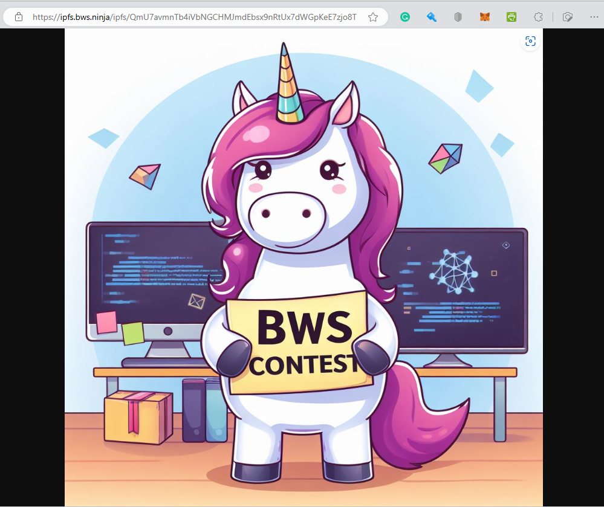

# Solution Overview

BWS **IPFS API Service** leverages the **InterPlanetary File System (IPFS)**, a distributed, peer-to-peer storage protocol designed to create a permanent and decentralized method of storing and sharing data. IPFS breaks files into smaller chunks, distributes them across the network, and assigns each file a unique content identifier (CID) for efficient retrieval.

## [BWS IPFS Gateway](solution-overview.md#bws-ipfs-gateway)

Use **ipfs.bws.ninja** as the gateway to access the files you have uploaded to IPFS using BWS.&#x20;


An **IPFS gateway** acts as a bridge between the decentralized IPFS network and traditional web browsers, allowing users to access content stored on IPFS using standard HTTP protocols. This makes IPFS content easily accessible without requiring specialized software or configuration.


Check out our lovely unicorn on IPFS using the BWS Gateway: [https://ipfs.bws.ninja/ipfs/QmU7avmnTb4iVbNGCHMJmdEbsx9nRtUx7dWGpKeE7zjo8T](https://ipfs.bws.ninja/ipfs/QmU7avmnTb4iVbNGCHMJmdEbsx9nRtUx7dWGpKeE7zjo8T)

<figure><figcaption></figcaption></figure>

## **Key Features of IPFS**

* **Decentralized Storage**\
  Files are stored across multiple nodes, enhancing reliability and fault tolerance.
* **Content Addressing**\
  Data is retrieved using its CID, ensuring that files are immutable and tamper-proof.
* **Global Accessibility**\
  IPFS data can be accessed by any node in the network, fostering collaboration and resilience.

## **Supported File Types**

Our service supports **uploading images. PDF and JSON files**, making it ideal for use cases where these formats are predominant. Examples include:

* **NFT Metadata and Assets** \
  Storing JSON metadata files and associated images for blockchain applications.
* **Decentralized Content Delivery**\
  Hosting static resources like logos or graphics for web or app projects.
* **Data Integrity and Provenance**\
  Sharing structured data (e.g., JSON) in a transparent, verifiable way.
