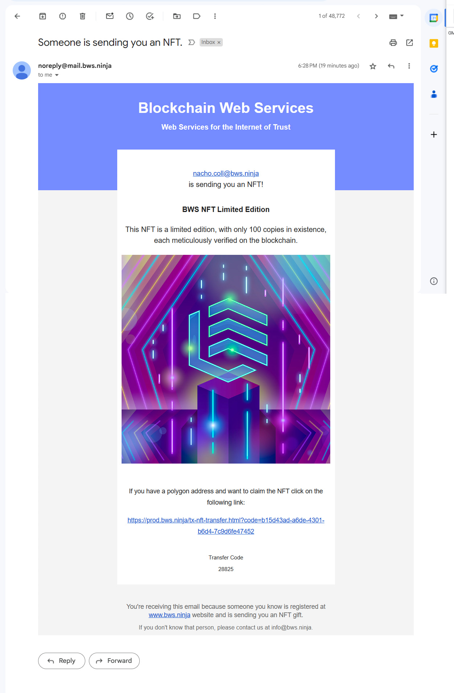
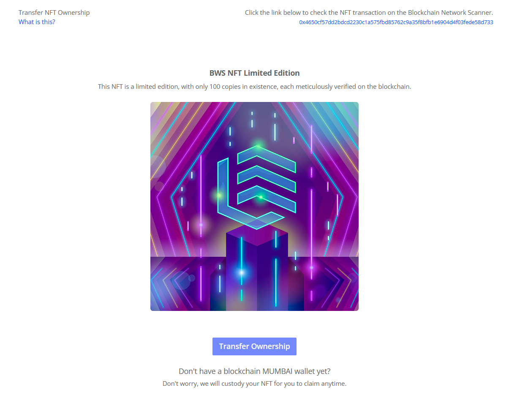

# Solution Overview

## [NFT Ownership](./#networks) <a href="#networks" id="networks"></a>

When you create a new NFT using BWS.NFT.zK (Zero Knowledge) solution, the NFT will initially be linked to your BWS account. In order to transfer an NFT ownership, you have two options:

* Transfer ownership to a blockchain wallet address.
* Transfer ownership to an email address.


Before you transfer your NFT, we will do the custody, and ownership is mapped with your BWS Account.


### <mark style="color:blue;">Transfer NFT Ownership to a Wallet</mark> <a href="#networks" id="networks"></a>

If you want to transfer an NFT ownership to another wallet address, you can simply use the [Transfer NFT](../operations/#transfer-nft) operation indicating the new blockchain wallet address owner.

### <mark style="color:blue;">Transfer NFT Ownership to an Email Address</mark> <a href="#networks" id="networks"></a>

If you want to transfer an NFT ownership, but the new owner does not have a Web3 Wallet (or you don't know it), you can simply transfer the ownership by using his email address.

<figure><figcaption><p>Email received for the new NFT owner to hold and get ownership</p></figcaption></figure>

We will send the new owner an email notification indicating he's the owner of the NFT. If he wants to transfer the ownership to his own Wallet, he will be able to.

<figure><figcaption><p>Transfer ownership page for wasy NFT transfers</p></figcaption></figure>


Please note that once you transfer the ownership using an email address, ONLY the email address owner will be able to transfer the NFT to a new Wallet address.


## [<mark style="color:blue;">NFT Metadata and Image Location</mark>](./#networks-3) <a href="#networks" id="networks"></a>

### NFT Image

<mark style="background-color:purple;">Your NFT image is always hosted in IPFS.</mark>

To create an NFT using BWS.NFT.zK, you pass the NFT image as:

* a web addressable URL, or,
* as an IPFS URI (for example, ipfs://QmcduEBAppXxnyn37deHHf33Ep7cPbYxn1mH36Nvvowki).


API Call JSON Example using a URL for the NFT image.

```json
{
    "name": "My NFT",
    "description": "My First NFT",
    "image": "https://uploads-ssl.webflow.com/6474d385cfec71cb21a92251/647dde8bbe8f094f5a0ee2c1_bws-violet.svg",
    "attributes":[
        {       
            "trait_type": "Rarity",
            "value": "Ultra rare" 
        }
    ]
}
```


In all the scenarios, your NFT metadata will point to an image stored in IPFS, as we will upload your image to IPFS if required.

### NFT Metadata

<mark style="background-color:purple;">Your NFT metadata is always hosted in IPFS.</mark>

When a new NFT is created, we create and upload the NFT metadata to IPFS,


**NFT Metadata Example**

<pre class="language-json"><code class="lang-json"><strong>{
</strong>    "name": "BWS NFT Limited Edition",
    "description": "This NFT is a limited edition, with only 100 copies in existence, each meticulously verified on the blockchain.",
    "image": "ipfs://QmcduEBAppXxnyn37deHHf33Ep7cPbYxn1mH36Nvvowkiu",
    "attributes": [
        {
            "trait_type": "Rarity",
            "value": "Ultra rare"
        }
    ]
}

</code></pre>


Your NFT blockchain transaction then points to IPFS, as you can see on the following example:

<figure><figcaption><p>NFT Creation Transaction Parameters</p></figcaption></figure>

## [Networks](./#networks) <a href="#networks" id="networks"></a>


We're updating this solution smart contracts for Polygon and Ethereum networks.\
Please use Matchain.


We currently offer NFT creation in Polygon and Ethereum blockchains.

| Blockchain   | Network Id | Description           |
| ------------ | ---------- | --------------------- |
| Matchain     | matchain   | Matchain blockchain.  |
| **Polygon**  | polygon    | Polygon blockchain.   |
|              | mumbai     | Polygon test network. |
| **Ethereum** | ethereum   | Ethereum blockchain   |


We recommend using the Polygon Mumbai network for tests.


### [**Smart Contracts**](./#smart-contracts)


We're updating this solution smart contracts for Polygon and Ethereum networks.\
Please use Matchain.


### Click on Contract Address to check the verified contract.

#### **Matchain**

<table><thead><tr><th width="172.33333333333334">Network Id</th><th width="453">Contract Address</th><th>Version</th></tr></thead><tbody><tr><td>matchain</td><td><a href="https://matchscan.io/address/0x6c555efde6f13b75dF488f8eFC3202f8a7FF8d05#code">0x6c555efde6f13b75dF488f8eFC3202f8a7FF8d05</a></td><td>1</td></tr></tbody></table>

#### **Polygon**

<table><thead><tr><th width="172.33333333333334">Network Id</th><th width="453">Contract Address</th><th>Version</th></tr></thead><tbody><tr><td>polygon</td><td></td><td></td></tr><tr><td>mumbai</td><td></td><td></td></tr></tbody></table>

#### **Ethereum**

<table><thead><tr><th width="172.33333333333334">Network Id</th><th width="453">Contract Address</th><th>Version</th></tr></thead><tbody><tr><td>ethereum</td><td></td><td>1</td></tr></tbody></table>

